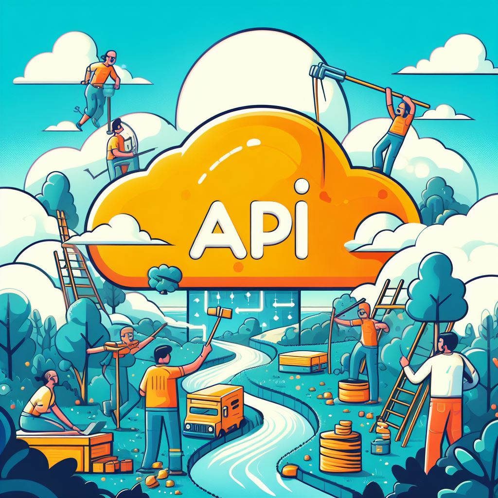

# Go Serverless API

Este é um projeto que demonstra como criar uma API REST Serverless em Go usando a AWS.

Usando as seguintes tecnologias e bibliotecas:

- [Gin](https://github.com/gin-gonic/gin): Um framework web em Go.
- [AWS Lambda](https://aws.amazon.com/lambda/): Um serviço de computação serverless da AWS.
- [AWS API Gateway](https://aws.amazon.com/api-gateway/): Um serviço para criar APIs REST na AWS.

## Estrutura do Projeto

O projeto é organizado da seguinte forma:

- `.serverless`: Pasta que pode ser gerada pelo framework Serverless (serverless.yml).
- `bin`: Contém o código compilado e binário do projeto.
- `Makefile`: Arquivo de configuração para compilar o projeto.
- `go.mod` e `go.sum`: Arquivos para gerenciar dependências do Go.
- `main.go`: O código principal do servidor da API.
- `serverless.yml`: Arquivo de configuração do Serverless Framework.

## Pré-requisitos

Antes de começar, você deve ter os seguintes requisitos instalados:

- Go: [Instalação do Go](https://golang.org/doc/install)
- Serverless Framework: [Instalação do Serverless Framework](https://www.serverless.com/framework/docs/getting-started)

## Como Configurar e Implantar

Siga essas etapas para configurar e implantar a API:

1. Clone o repositório: `git clone https://github.com/gabrielm3/go-serverless-api.git`
2. Entre na pasta do projeto: `cd go-serverless-api`
3. Compile o código: `make build`
4. Implante o serviço com o Serverless Framework: `sls deploy`

## Uso

Após a implantação bem-sucedida, você pode usar a **API REST**. Aqui está um exemplo de rota de teste:

- Rota de teste: `GET /ping`

Você pode fazer solicitações para a rota de teste usando a URL fornecido após a implantação.

## Contribuindo

Contribuições são bem-vindas! Se você encontrar um bug ou tiver uma melhoria, sinta-se à vontade para abrir um problema ou enviar um pull request.

## Licença

Este projeto está licenciado sob a Licença MIT. Consulte o arquivo LICENSE para obter detalhes.
